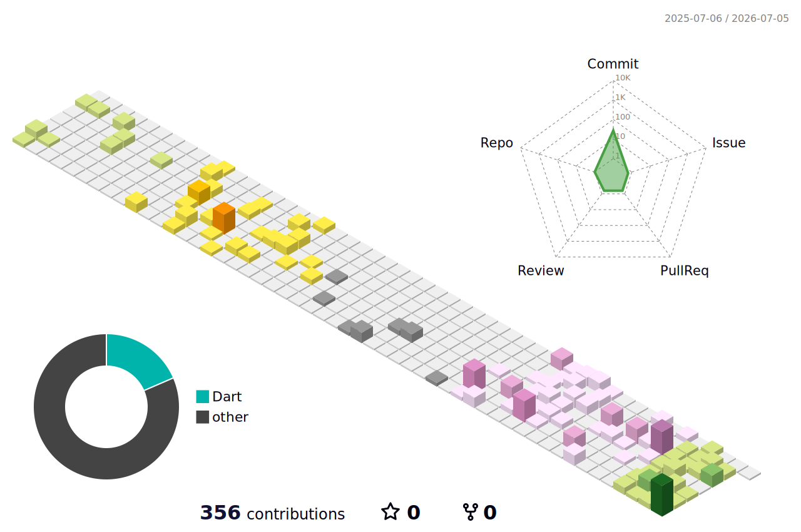

<div align="center">


<br/>


<br/><br/>

<a href="mailto:ktanvir29@gmail.com">
  
</a>
<a href="https://github.com/TanvirKhan77">
  
</a>
<a href="https://linkedin.com/in/tanvirahmedkhan777">
  
</a>
<a href="https://tanvir-ahmed-khan.web.app">
  
</a>
<a href="https://tanvir-ahmed-khan.web.app/design-3d">
  
</a>

<br/><br/>


<br/><br/>


</div>

---

<div align="center">

## `> SYSTEM.IDENTITY`


</div>

<table>
<tr>
<td width="55%" valign="top">

```yaml
name: Tanvir Ahmed Khan
role: Software Developer
mode: Full-Stack Engineer
secondary_mode: 3D Artist + Motion Designer
current_stack:
  - Flutter
  - React
  - TypeScript
  - Firebase
  - Supabase
  - REST APIs
  - Vercel
backend_focus:
  - Java
  - Spring Boot
  - PostgreSQL
  - API Architecture
  - JUnit
  - Mockito
creative_stack:
  - Blender
  - After Effects
  - Photoshop
  - Illustrator
  - Premiere Pro
motto: "Code clean. Design bold. Ship with purpose."
```

</td>
<td width="45%" valign="top">

<div align="center">


</div>

</td>
</tr>
</table>

I build production-ready mobile, web, and backend systems with a focus on clear architecture, clean user experiences, and maintainable release workflows. My core stack includes **Flutter, React, TypeScript, Firebase, Supabase, REST APIs, and cloud deployment**.

I also create **3D animation, motion graphics, and visual storytelling** with tools like **Blender, After Effects, Photoshop, Illustrator, and Premiere Pro**, bringing software engineering and creative direction into the same workflow.

---

<div align="center">

## `> ANIMATED.SIGNAL`


<br/><br/>


</div>

---

<div align="center">

## `> TECH.ARSENAL`


<br/>


<br/>


<br/>


</div>

---

<div align="center">

## `> FEATURED.PROJECTS`


</div>

<table>
<tr>
<td width="50%" valign="top">

### `Cikitsa International`

A production telemedicine app with appointment booking, video consultation, prescription management, OTP verification, visa invitation workflow, MRZ passport scanning, payment integration, push notifications, storage, and crash reporting.

`Flutter` `Firebase Auth` `Firestore` `Cloud Messaging` `Storage` `Crashlytics` `SSLCommerz`

</td>
<td width="50%" valign="top">

### `Trippo V2`

A multi-app ride-sharing ecosystem with admin, web, rider, and driver apps. Includes request flow, driver offers, acceptance, arrival, trip start, completion, archive, live tracking, ETA, and role-based access control.

`Flutter` `Next.js` `TurboRepo` `pnpm` `Firebase` `Google APIs`

</td>
</tr>

<tr>
<td width="50%" valign="top">

### `Tuff Luck`

A real-time multiplayer card game with room-based gameplay, instant game-state synchronization, turn management, and live player interactions.

<a href="https://tuff-luck.vercel.app">
  
</a>

`React 18` `TypeScript` `Supabase Realtime` `Vercel`

</td>
<td width="50%" valign="top">

### `Mini Campaign API`

A backend-focused campaign management API built with layered architecture: Controller, Service, Repository, DTO, and Entity. Includes validation, persistence, message status tracking, scheduling concepts, and service-layer testing practice.

`Java` `Spring Boot` `PostgreSQL` `REST API` `JUnit` `Mockito` `Postman`

</td>
</tr>

<tr>
<td width="50%" valign="top">

### `Pew Pew Armies`

A full-stack React and TypeScript web application with Firebase Authentication, Firestore operations, deployment workflow, responsive UI components, and reusable Tailwind CSS patterns.

`React` `TypeScript` `Vite` `Firebase` `Tailwind CSS`

</td>
<td width="50%" valign="top">

### `3D & Motion Design`

Promotional videos, 3D animations, social media content, artist branding, album visuals, event posters, thumbnails, and creative visual direction.

<a href="https://tanvir-ahmed-khan.web.app/design-3d">
  
</a>

`Blender` `After Effects` `Photoshop` `Illustrator` `Premiere Pro`

</td>
</tr>
</table>

---

<div align="center">

## `> CURRENT.FOCUS`

</div>

```txt
[01] Strengthen backend engineering with Java, Spring Boot, PostgreSQL, and REST API design
[02] Build clean mobile apps with Flutter, Firebase, offline support, and release workflows
[03] Create modern web apps with React, TypeScript, Supabase, and Vercel deployment
[04] Improve testing, CI/CD, documentation, architecture, and scalable SaaS thinking
[05] Blend software engineering with 3D animation, motion design, and creative storytelling
[06] Use AI-assisted development responsibly for debugging, planning, prototyping, and docs
```

---

<div align="center">

## `> GITHUB.TELEMETRY`


<br/>


<br/><br/>


</div>

---

<div align="center">

## `> 3D.CONTRIBUTION.MATRIX`



<br/><br/>


</div>

---

<div align="center">

## `> ACTIVITY.SNAKE.PROTOCOL`

<picture>
  <source media="(prefers-color-scheme: dark)" srcset="https://raw.githubusercontent.com/TanvirKhan77/TanvirKhan77/output/github-contribution-grid-snake-dark.svg" />
  <source media="(prefers-color-scheme: light)" srcset="https://raw.githubusercontent.com/TanvirKhan77/TanvirKhan77/output/github-contribution-grid-snake.svg" />
  
</picture>

</div>

---

<div align="center">

## `> TROPHY.CACHE`


</div>

---

<div align="center">

## `> CREATIVE.MODE`


</div>

```txt
> 3D Visuals
> Motion Graphics
> Album Teasers
> Event Posters
> Social Media Content
> Promotional Videos
> Brand Visual Direction
> Developer Tools + Creative Automation
```

---

<div align="center">

## `> TRANSMISSION.OPEN`

<a href="mailto:ktanvir29@gmail.com">
  
</a>
<a href="https://linkedin.com/in/tanvirahmedkhan777">
  
</a>
<a href="https://tanvir-ahmed-khan.web.app">
  
</a>
<a href="https://tanvir-ahmed-khan.web.app/design-3d">
  
</a>

<br/><br/>


<br/>


</div>
