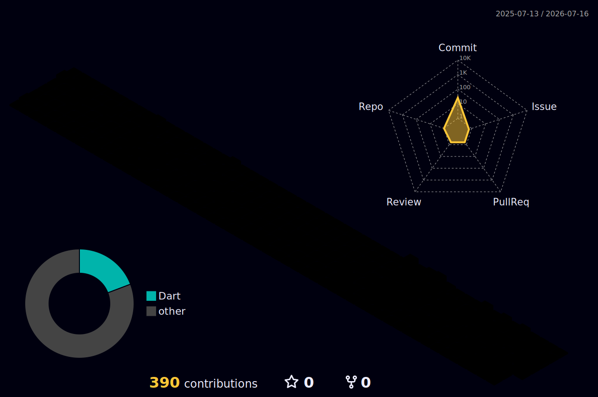

<div align="center">




<a href="mailto:ktanvir29@gmail.com">
  
</a>
<a href="https://github.com/TanvirKhan77">
  
</a>
<a href="https://linkedin.com/in/tanvirahmedkhan777">
  
</a>
<a href="https://tanvir-ahmed-khan.web.app">
  
</a>
<a href="https://www.patreon.com/c/TanvirAhmedKhan7777">
  
</a>


</div>

---

## `> About`

I build mobile, web, and backend products with **Flutter, React, TypeScript, Firebase, Supabase, Java, Spring Boot, PostgreSQL, REST APIs, and cloud deployment**. I also create **3D animation, motion graphics, promotional visuals, and creative tools** with Blender and Adobe workflows.

```yaml
name: Tanvir Ahmed Khan
role: Full-Stack Developer
creative_mode: 3D Artist + Motion Designer
focus: Clean architecture, polished UI, scalable APIs, reliable releases
stack: Flutter, React, TypeScript, Firebase, Supabase, Spring Boot, PostgreSQL
```

---

## `> Skills`

<div align="center">


</div>

---

## `> GitHub Signal`

<div align="center">



</div>

---

## `> Support Me`

<div align="center">

<a href="https://www.patreon.com/c/TanvirAhmedKhan7777">
  
</a>

</div>

---

## `> Contact`

<div align="center">

<a href="mailto:ktanvir29@gmail.com">
  
</a>
<a href="https://linkedin.com/in/tanvirahmedkhan777">
  
</a>
<a href="https://tanvir-ahmed-khan.web.app">
  
</a>


</div>
